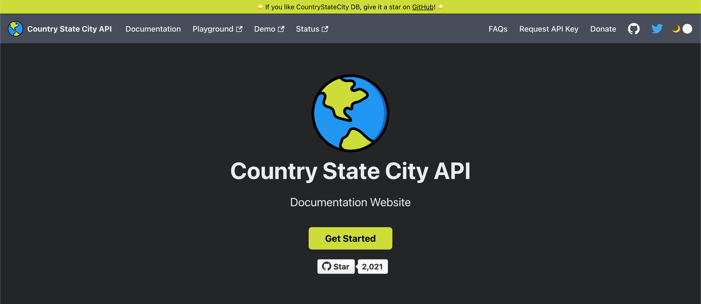

# 🌍 Countries States Cities Database

Full Database of city state country available in JSON, SQL, XML, YAML & CSV format.
All Countries, States & Cities are Covered & Populated with Different Combinations & Versions.
## API 🚀
🎉 Introducing **API** for Countries States Cities Database.

[API Documentation](https://countrystatecity.in/)

## Available Formats
- JSON
- SQL
- XML
- YAML
- CSV

## Distribution Files Info
File | JSON | SQL | XML | YAML | CSV
:------------ | :-------------| :-------------| :------------- |:-------------|:-------------
Countries | :white_check_mark: | :white_check_mark: | :white_check_mark: | :white_check_mark: | :white_check_mark:
States | :white_check_mark: | :white_check_mark: | :white_check_mark: | :white_check_mark: | :white_check_mark:
Cities | :white_check_mark: | :white_check_mark: | :white_check_mark: | :white_check_mark: | :white_check_mark:
Country+States | :white_check_mark: | NA | :white_check_mark: | :white_check_mark: | NA
Country+Cities | :white_check_mark: | NA | :white_check_mark: | :white_check_mark: | NA
State+Cities | :white_check_mark: | NA | :white_check_mark: | :white_check_mark: | NA
Country+State+Cities/World | :white_check_mark: |  :white_check_mark: | :white_check_mark: | :white_check_mark: | NA

## Demo
https://dr5hn.github.io/countries-states-cities-database/

## Insights
Total Countries : 250  
Total States/Regions/Municipalities : 4,979  
Total Cities/Towns/Districts : 148,266  

Last Updated On : 21st May 2022

## When's the next API Database Update day?
I usually update API's database once a quarter.

**Upcoming API Database Update Date:** 17th July 2022

**Please Note:** Even if you've urgency or you're running this API in Production and you find some data missing, the API Database update dates won't be changed at any circumstances.

That's all Folks. Enjoy.
